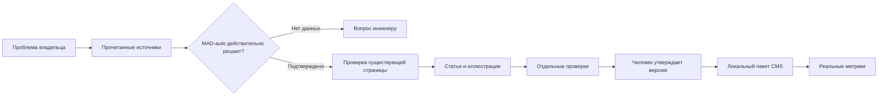

<div align="center">

# MAD-auto · редакционный конвейер

**Реальная проблема → подтверждённое решение → полезная статья**

[](https://github.com/f2re/mad-seo-skill/actions/workflows/test.yml)


Не автомобильный новостной генератор. Инструментарий для статей о связи с ЭБУ,
WiFi OBD2, ECU Logger, Dashboard и WiFi AFR — с проверкой применимости и источников.

[Начать](docs/START.md) · [Процесс](docs/WORKFLOW.md) · [Темы](knowledge/problems.json) · [Поиск и ИИ](docs/SEO-AI.md) · [Что найдено при аудите](docs/MIGRATION-AUDIT.md)

</div>

## Что уже работает

| Задача | Реализация |
|---|---|
| Найти не общую тему, а затруднение владельца | 13 нишевых направлений, задания исследователю, импорт прочитанных наблюдений |
| Не продавать несуществующее решение | 11 документированных возможностей, ограничения и первичные источники |
| Не выдавать старую новость за тренд | Отдельные даты события/чтения, повторы, сравнение полных одинаковых окон |
| Не плодить статьи-дубли | Связь проблемы с существующим URL; выбор создания, обновления или объединения |
| Написать проверяемую инструкцию | Резюме, применимость, подготовка, шаги, результат, ошибки и ограничения |
| Не выдумывать совместимость | Режим общей инструкции или точная связка ЭБУ—ПО—адаптер—прошивка—приложение |
| Отсечь пустые обещания | Связанные факты, числовые проверки, запрет клише и универсальных обещаний |
| Подготовить материал для сайта и ИИ-поиска | Семантический HTML, источники у разделов, canonical, TechArticle и BreadcrumbList |
| Сохранить контроль владельца | Человек утверждает конкретный хеш; изменения отзывают актуальность утверждения |
| Передать в новый сайт | Локальный пакет CMS для `/blog/`, без непроверенного API и изменения рабочего сайта |

## Запуск

Нужен Python 3.10+. Устанавливать зависимости и указывать ключ модели не требуется.

```bash
git clone https://github.com/f2re/mad-seo-skill.git
cd mad-seo-skill
python mad.py init
python mad.py doctor
python mad.py search-plan
python mad.py topics
python mad.py new bridge-ports --problem com-pair
```

Откройте папку в среде ИИ и дайте задание:

> Используй mad-content. Исследуй проблему bridge-ports, подтверди решение по документации MAD-auto,
> заполни источники и утверждения. Делегируй отдельные техническую, редакционную и поисковую проверки.
> Подготовь статью и предпросмотр. Не утверждай от имени человека и не публикуй на сайт.

**Модель пишет текст и использует доступный веб-поиск. Python не генерирует статью и не имитирует поиск.**
Пустое задание намеренно не проходит проверку: сначала нужны прочитанные источники и конкретная польза.

## Как устроен проход



Координатор и восемь профильных ролей: исследователь проблем, инженер решения, проверяющий факты,
редактор, поисковый редактор, арт-директор, проверяющий безопасность и аналитик.
Максимум три задачи параллельно; автор не принимает собственную статью как независимый проверяющий.

Восемь сценариев: `mad-plan`, `mad-research`, `mad-content`, `mad-visuals`, `mad-seo-ai`,
`mad-review`, `mad-publish`, `mad-analytics`. Точки входа для Codex, Claude Code и Antigravity
генерируются из единых канонических файлов. [Ограничения интеграции](docs/INTEGRATIONS.md).

## Первые темы

Начните с COM-пары WiFi-Bridge, отсутствующего Boost, неправильного напряжения в панели,
разницы приложения и платного модуля, автономной записи CSV и несовпадения шкал AFR.
Весь [список из 13 направлений](knowledge/problems.json) связан с подтверждёнными возможностями.

**Сейчас это гипотезы по документации, а не измеренные растущие тренды.** Свежие обсуждения и собственные
поисковые выгрузки ещё предстоит собрать. Повторение вопроса и рост спроса — разные выводы.
Для DSG и других контроллеров сначала требуется подробная техническая база; универсальных обещаний нет.

## Проверка и передача

```bash
python mad.py validate bridge-ports
python mad.py export bridge-ports
python mad.py review-template bridge-ports
python mad.py status bridge-ports
# После проверки и явного поручения человека:
python mad.py approve bridge-ports --confirm 'bridge-ports@ПОЛНЫЙ_SHA256'
python mad.py export bridge-ports --approved
```

Экспорт: HTML, Markdown, JSON для CMS, структурированные данные и выбранные изображения.
Предпросмотр **всегда noindex**. Одобрение не отправляет статью в интернет. Настоящие URL медиа,
даты публикации и индексируемость проверяет интегратор CMS при размещении.

[Пример черновика по COM-мосту](examples/article-demo/pack.json) · [Передача в CMS](docs/PUBLISHING.md).

## База знаний и обнаруженные проблемы

[Источники](knowledge/sources.json) · [Возможности](knowledge/capabilities.json) ·
[Конфликты](knowledge/conflicts.json) · [Проверка сайта](knowledge/site-audit.json).

При чтении документации 2026-10-05 обнаружено расхождение версии Innovate между страницами;
его нельзя замалчивать в статье. Подозрительная цена «от 5 ₽», советы отключить защиту ПК,
нелицензионная активация COM-драйвера и таблицы совместимости в изображениях также вынесены отдельно.
Сами сайты этой работой не изменены.

## Пределы этой версии

Нельзя гарантировать индексацию и цитирование всеми нейросетями. Автопроверка ловит структуру
и известные ошибки, но не доказывает истинность и не определяет авторство текста.
Наличие файлов ролей не доказывает их запуск в конкретной среде.

Авторизованный API нового сайта не проверен: здесь нейтральный экспорт, не WordPress по догадке.
Аналитика — нормализованный CSV и локальная база; прямые OAuth-адаптеры Bamboo в эту версию не включены.
Собственные автомобильные испытания, свежий измеренный спрос и человеческая приёмка примера не заявляются.

## Разработка

```bash
python -m unittest discover -s tests -v
python tools/sync_adapters.py --check
python mad.py knowledge-check
python tools/check_repository.py
```

60 автоматических тестов; CI настроен на Python 3.10–3.13. [Протокол проверки](docs/VERIFICATION.md).
Рабочие статьи, метрики и приватные материалы исключены из git. Лицензия MIT.

Основа процесса — [bamboo-seo-skill](https://github.com/f2re/bamboo-seo-skill), закреплённая версия
`93a7b5bc28f45405d3fcf1f68bd464c6e946bfc4`. Это предметная переработка, не замена названия керамического проекта.
[Решения адаптации](docs/MIGRATION-AUDIT.md) · [Происхождение и права](NOTICE.md).
